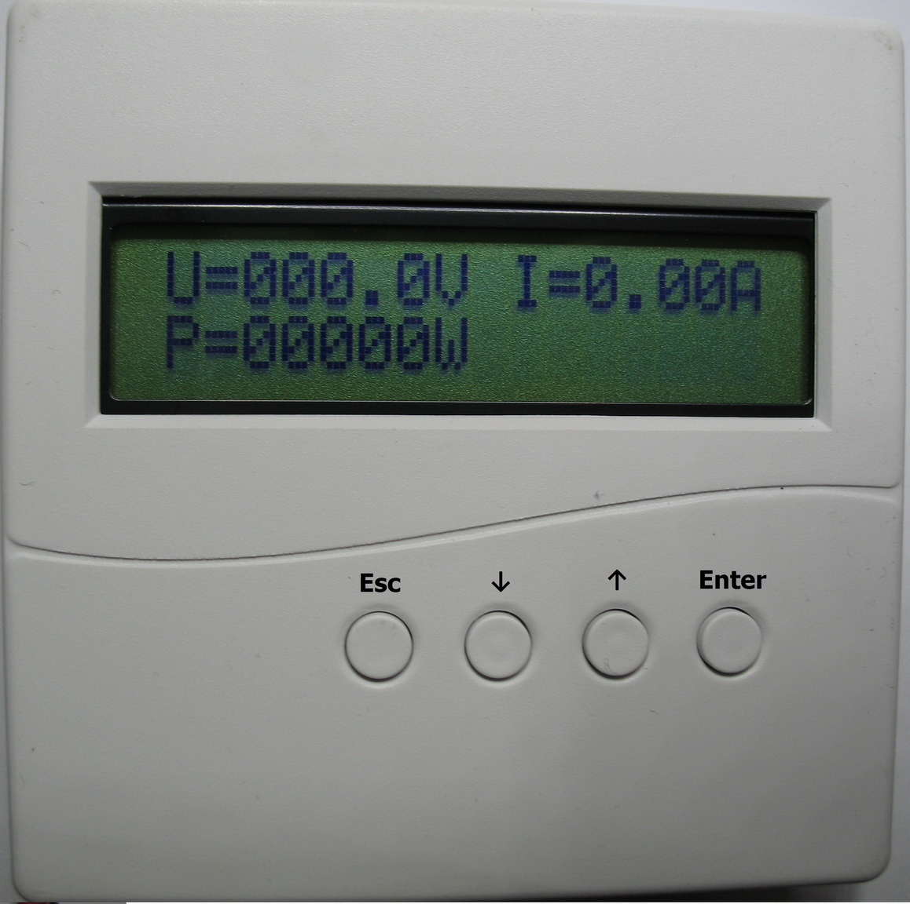

### Контроллер чтения показаний счетчика Меркурий 200.02.
---

Контроллер построен на ARM 32-bit Cortex-M3 STM32F103C8T6, 64 kB flash, 20 kB SRAM, используемые интерфейсы: UART, SPI.

---

#### Функции:
* Контроллер предназначен для совместной работы со счетчиком «Меркурий-200» (модификации: 02) для чтения мгновенных значений: напряжения сети, тока в цепи нагрузки, мощности нагрузки и значений накопленной потребленной энергии по тарифам Т1, Т2. Значения, считанные из счетчика отображаются на символьном ЖК дисплее. 
* Контроллер позволяет сохранять считанные значения счетчика на MicroSD карте (логирование данных). Режим и периодичность сохранения данных определяется настройками контроллера. Сохранение данных выполняется в файлах: YYYYMM\YYYYMMDD_dat.csv – мгновенные значения счетчика (U,I,P), YYYYMM\YYYYMMDD_tar.csv и YYYY_tar.csv – значение тарифов Т1,T2. Сохранение значений тарифов выполняется в 00:00:00 по встроенным часам реального времени контроллера. При выключенном питании контроллера, поддержание хода встроенных часов выполняется с помощью элемента CR1220.
* Контроллер может быть подключен к сети ModBus.

---

#### Подключение:
Подключение контроллера к счетчику осуществляется 4-х проводным соединением +5V, 0V, CANH, CANL. Линии +5V, 0V обеспечивают питание опторазвязки интерфейса CAN на стороне счетчика, питание +5V обеспечивает контроллер. Интерфейс CAN работает на скорости от 600 до 9600 Бод. 

